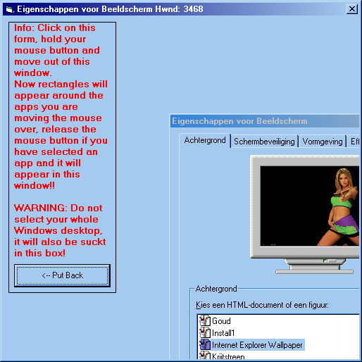

## Move a program to an MDI form

### Description

With this program you can select another window on your screen and move it to an MDI container!

Warning: do not use if you do not have much experience with VB or Windows
 
### More Info
 
Do not use if you do not have much experience with VB or Windows

If you use this wrong your Windows shell can be wrecked, with can be fixed by a reboot.

             |
---                |---
**Submitted On**   |2002-03-08 14:40:50
**By**             |[Peter Hebels](https://github.com/Planet-Source-Code/PSCIndex/blob/master/ByAuthor/peter-hebels.md)
**Level**          |Advanced
**User Rating**    |4.7 (14 globes from 3 users)
**Compatibility**  |VB 6\.0
**Category**       |[Miscellaneous](https://github.com/Planet-Source-Code/PSCIndex/blob/master/ByCategory/miscellaneous__1-1.md)
**World**          |[Visual Basic](https://github.com/Planet-Source-Code/PSCIndex/blob/master/ByWorld/visual-basic.md)
**Archive File**   |[Move\_a\_pro60637382002\.zip](https://github.com/Planet-Source-Code/peter-hebels-move-a-program-to-an-mdi-form__1-32478/archive/master.zip)

